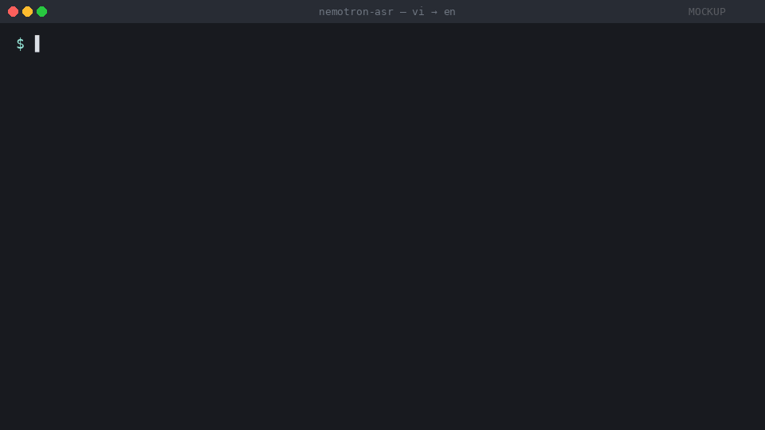

# nemotron-asr-realtime-translate

<!--
  demo/demo.gif is currently a programmatic mockup rendered by
  demo/make-mockup.py — it faithfully mirrors stream_translate.py's live UI
  (parallel ASR partial + translator draft, then commit). Replace it with a
  real screen recording before any public launch — see demo/README.md.
-->


**Real-time speech translation built on Nemotron-3.5 ASR.** Stream audio in
any of **19 source languages** (English, Vietnamese, Chinese, Spanish, French,
German, Italian, Portuguese, Japanese, Korean, Arabic, Russian, Thai,
Indonesian, Malay, Hindi, and more) and translate to any of **200 target
languages** via NLLB. Runs on a MacBook CPU. No API keys. No cloud.

**Vi ↔ En ships as the well-tuned foundation example** — custom translator,
sub-second latency, defaults tuned for tone-language speech — but the same
pipeline drives any other pair via `--lang` and `--target-lang`.

## Assistant mode — "Nemo ơi" (v0 scaffold)

The streaming pipeline also underpins a Vietnamese voice assistant. Say
**"Nemo ơi"** to wake it, then a command — time, alarms, translate,
Home Assistant control. All local. No accounts. Rule-based intent routing;
LLM chit-chat deferred to v2.

```bash
./assistant.sh                    # start assistant (terminal)
./assistant.sh --setup            # first-run wizard (writes ~/.config/nemo-assistant.yaml)
./assistant.sh --wake-only        # test wake detection without ASR
./assistant.sh --no-tts           # print responses to stdout instead of speaking
```

Skills shipped in v0:

| Skill | Example command | Response |
|---|---|---|
| Time / date | "Nemo ơi, mấy giờ rồi?" | "Bây giờ là tám giờ ba mươi phút sáng" |
| Alarms & timers | "Nemo ơi, đặt báo thức 6 giờ sáng" | "Đã đặt báo thức lúc sáu giờ sáng" |
| Translate (any of 200 langs) | "Nemo ơi, dịch sang tiếng Anh: xin chào bạn" | "Hello, friend" |
| Home Assistant | "Nemo ơi, tắt đèn phòng khách" | "Đã tắt đèn phòng khách" |

**Two ways to get to the always-on experience:**

```bash
# Immediate: push-to-talk (no wake model needed — press ENTER each turn)
./nemo.sh ptt

# Full: train a "Nemo ơi" wake model from Piper-synthesized data
./nemo.sh wake-train all          # ~30-60 min, fully automated
./nemo.sh assistant               # then say "Nemo ơi"
```

The training pipeline is **pluggable via `data/wake/manifest.yaml`** — start
with 100% synthetic data (default), add real recordings to
`data/wake/positive_real/` when you have them, and re-run `wake-train train`.
Real recordings are weighted 4× per file so even ~50 improve the model
meaningfully. Full design walkthrough in
**[docs/assistant/01-wake-word-training.md](docs/assistant/01-wake-word-training.md)**,
plus the whole assistant story in
**[docs/assistant/00-build-story.md](docs/assistant/00-build-story.md)**.

## Stack at a glance

| Layer | Choice | Why |
|---|---|---|
| Streaming ASR | **Nemotron-3.5-asr-streaming-0.6b** (NVIDIA, NeMo) | **19 production languages**, cache-aware streaming Conformer with prompt conditioning per language |
| ASR runtime | **ONNX Runtime (CPU EP)** | Custom export with cache I/O → 8× faster than PyTorch on CPU (RTF 1.6 → 0.20) |
| Translation (general) | **NLLB-200-distilled-600M** (Meta) via **CTranslate2 int8** | **200 languages** — covers any pair the ASR supports |
| Translation (Vi↔En showcase) | **EnViT5** (VietAI) via CTranslate2 int8 | SOTA on PhoMT/MTet, OpenRAIL (commercial OK), 3× smaller than NLLB — default for `--lang vi-VN` |
| Noise suppression | **GTCRN** via sherpa-onnx (opt-in `--denoise`) | ~40 ms/chunk; feeds the silence VAD without touching ASR audio |
| Web UI | **FastAPI** + **uvicorn[standard]** + WebSocket | Multi-client browser display of the same pipeline |
| Audio capture | **alsaaudio** (Linux) / **sounddevice** shim (macOS, Windows) | Native ALSA where available, cross-platform fallback elsewhere |
| Runtime | **Python 3.13** + **PyTorch 2.12** + **NeMo `@main`** | NeMo pinned to git main for the Nemotron streaming class |
| First-run setup | `_bootstrap.sh` auto-creates `.venv`, installs from `requirements.txt` | Just `./stream_translate.sh` and it boots |
| Project license | **MIT** | See [LICENSE](LICENSE); each model has its own license, all are commercial-friendly |

End-to-end: 16 kHz mic → MicProducer (buffered, optional denoise) → 560 ms streaming chunks → ONNX-routed Conformer encoder → RNNT decoder → commit on silence/punctuation/lang-tag → CTranslate2 translator worker → terminal or WebSocket display. ~1 s perceived latency per utterance on M-series CPU.

## Use it with any language pair

```bash
# Default — Vi → En (the polished example)
./stream_translate.sh

# Spanish → English
./stream_translate.sh --lang es-ES --target-lang en-US --translator nllb

# English → Japanese
./stream_translate.sh --lang en-US --target-lang ja-JP --translator nllb

# Chinese → Vietnamese
./stream_translate.sh --lang zh-CN --target-lang vi-VN --translator nllb

# Hindi → Arabic (any of 19 source × 200 target combos works)
./stream_translate.sh --lang hi-IN --target-lang arb_Arab --translator nllb
```

`--translator nllb` switches to NLLB-200 for non-Vi-En pairs. Source language codes follow Nemotron's prompt dictionary (BCP-47 style); target codes are the NLLB code map in `translator.py:ASR_TO_NLLB` (e.g. `eng_Latn`, `vie_Latn`, `jpn_Jpan`).

## What this is

A small but production-shaped pipeline that wires three open models together:

| Stage | Model | License |
|---|---|---|
| Streaming ASR | [`nvidia/nemotron-3.5-asr-streaming-0.6b`](https://huggingface.co/nvidia/nemotron-3.5-asr-streaming-0.6b) — cache-aware Conformer, 19 production languages incl. Vietnamese | NVIDIA Open Model (commercial OK) |
| Translation (default) | [`VietAI/envit5-translation`](https://huggingface.co/VietAI/envit5-translation) — T5 specialized on Vi↔En via PhoMT/MTet | OpenRAIL-M (commercial OK) |
| Translation (alternate) | [`facebook/nllb-200-distilled-600M`](https://huggingface.co/facebook/nllb-200-distilled-600M) — 200 languages | MIT |
| Noise suppression (optional) | [GTCRN](https://github.com/Xiaobin-Rong/gtcrn) via sherpa-onnx | MIT / Apache-2.0 |

Two interfaces ship out of the box:

- **`./stream_translate.sh`** — terminal UI: live partial as you speak, finalized lines with translation under each.
- **`./stream_web.sh`** — FastAPI + WebSocket UI in the browser, same pipeline, multiple clients can watch the same session.

## Why it exists

In 2026 most streaming-translation tools are either cloud APIs (Google, OpenAI, Azure — your audio leaves your machine, you need a key, you pay per minute) or English-first open-source demos that treat every other language as an afterthought.

This repo is the open answer: **any of Nemotron's 19 source languages → any of NLLB's 200 targets**, live, on a laptop, free, source-available. The encoder runs through ONNX Runtime for ~8× speedup so it actually keeps up with real-time on a MacBook CPU; CTranslate2 int8 keeps translation under 200 ms per utterance.

**The Vi↔En path is the polished showcase** because that's the niche the project was anchored to — defaults are tuned for tone-language speech, the EnViT5 translator was picked specifically because it beats NLLB on Vi↔En per PhoMT/MTet benchmarks, and the silence/punctuation commit logic was tested against Vietnamese sentence patterns. Other language pairs work today via the NLLB backend; treat them as well-supported but less custom-tuned. PRs improving any other pair are welcome.

## One entry point for everything

Every mode of the project runs through **`./nemo.sh`**:

```bash
./nemo.sh                         # interactive menu
./nemo.sh --help                  # list every command
./nemo.sh stream                  # ASR + translation, terminal UI
./nemo.sh web                     # same, browser at :8765
./nemo.sh assistant               # voice assistant ("Nemo ơi")
./nemo.sh setup                   # first-run wizard for the assistant
./nemo.sh mic-test 5              # 5-second mic → ASR round-trip
./nemo.sh bench rtf               # ASR real-time-factor benchmark
./nemo.sh bench wake              # wake-word FAR/FRR benchmark
./nemo.sh smoke                   # smoke test on bundled audio (no mic)
./nemo.sh regress                 # end-to-end assistant regression
./nemo.sh wake-train prepare      # generate synthetic wake-word data
```

Any flags after the subcommand pass through to the underlying script, e.g.
`./nemo.sh stream --translator nllb --lang vi-VN` or
`./nemo.sh assistant --no-tts`. The individual wrappers (`stream_translate.sh`,
`assistant.sh`, …) keep working standalone; `nemo.sh` just dispatches.

## Quick start

```bash
git clone https://github.com/nguyentuansi/nemotron-asr-realtime-translate.git
cd nemotron-asr-realtime-translate
./nemo.sh
```

That's it. First run does ~10 minutes of one-time setup:

1. Auto-creates a Python 3.13 venv (`_bootstrap.sh` finds the best Python in your `PATH`)
2. Installs torch, NeMo (from `@main` — Nemotron-3.5 isn't on PyPI NeMo yet), ctranslate2, fastapi, sherpa-onnx
3. Downloads the Nemotron ASR model (~2.4 GB) into `.hf-cache/`
4. Loads the Vietnamese ↔ English translator (run the conversion once with `ct2-transformers-converter` — instructions appear if the directory is missing)

Subsequent runs start in ~30 seconds (model load time).

### Run with noise suppression

If you're in a noisy room (fan, AC, traffic), the silence-VAD has trouble detecting when you've actually paused:

```bash
./stream_translate.sh --denoise
```

This uses GTCRN to give the VAD a clean reference signal so pauses commit reliably. The ASR still sees raw audio so Vietnamese tones aren't damaged. GTCRN auto-downloads on first use (~520 KB).

### Run the web UI

```bash
./stream_web.sh
# open http://127.0.0.1:8765 in a browser
```

Same pipeline, different display. Useful for screen-sharing, captioning meetings, or running ASR on a beefy machine and viewing from a phone on the same network.

## Features

- **Wide language coverage** — 19 source ASR languages × 200 NLLB target languages = thousands of pairs, all swappable with two CLI flags
- **Bidirectional Vi ↔ En specialist** built in (~275 M params int8 EnViT5) as the polished foundation example; specialist translators for other pairs can be added via `make_translator` in `translator.py`
- **Streaming, not batched** — partial transcripts appear chunk-by-chunk (560 ms cadence), commits land on natural sentence boundaries
- **CPU-real-time** on Apple Silicon via ONNX Runtime (encoder exported with cache-state I/O, ~8× speedup over PyTorch)
- **Drop-in CUDA support** — if `torch.cuda.is_available()`, the ASR runs on GPU automatically
- **Cross-platform mic capture** — native ALSA on Linux, `sounddevice` shim everywhere else (`alsa_shim.py`)
- **Session recording + structured logs** — every run writes `logs/audio-<ts>.wav` (raw mic) + `logs/stream-<ts>.log` (per-chunk debug) for offline replay
- **Backwards-compatible flags** — every default in this README is overridable from the CLI

## Architecture

```
   mic (16 kHz mono S16)
      │
      ▼
  ┌─────────────────────────────────────────────┐
  │ MicProducer (background thread)              │
  │   - alsa_shim or alsaaudio capture           │
  │   - write RAW to logs/audio-<ts>.wav         │
  │   - optional: GTCRN denoise -> VAD peak only │
  │   - bounded ring buffer (--max-buffer-secs)  │
  └─────────────────────────────────────────────┘
      │ float32 PCM, 16 kHz mono
      ▼
  ┌─────────────────────────────────────────────┐
  │ Streaming ASR loop (main thread)             │
  │   - 560 ms chunks                            │
  │   - CacheAwareStreamingAudioBuffer (NeMo)    │
  │   - encoder.forward via ONNX Runtime         │
  │   - RNNT decoder in PyTorch (stateful LSTM)  │
  │   - cache_last_channel / time / len threaded │
  │     through every chunk                      │
  └─────────────────────────────────────────────┘
      │ partial + final hypotheses
      ▼
  ┌─────────────────────────────────────────────┐
  │ Commit logic                                 │
  │   - silence VAD (peak<threshold for Ns)      │
  │   - end-of-utterance <lang> tag              │
  │   - sentence-final punctuation               │
  └─────────────────────────────────────────────┘
      │ committed source-language text
      ▼
  ┌─────────────────────────────────────────────┐
  │ Translator worker (background thread)        │
  │   - CTranslate2 int8 (EnViT5 or NLLB)        │
  │   - FINAL queue (committed text) drained 1st │
  │   - DRAFT slot (latest partial) for live UX  │
  └─────────────────────────────────────────────┘
      │ English translation
      ▼
   terminal display  |  WebSocket -> browser
```

## Performance

Measured on M-series MacBook Pro, CPU only, default `560 ms` chunks:

| Stage | PyTorch CPU | ONNX CPU (default) |
|---|---:|---:|
| ASR avg chunk time | 921 ms | **114 ms** |
| ASR RTF | 1.64 | **0.20** |
| Translator (EnViT5 int8) | 80-200 ms / utterance | same |
| Denoiser (GTCRN, optional) | — | +30-40 ms / chunk |
| End-to-end RTF | 1.6+ (lagging) | ~0.25 (real-time) |

See [`docs/performance/`](docs/performance/) for the full ONNX export + integration recipe if you want to reproduce or extend the optimization.

## Common flags

```bash
# Default — Vi -> En with EnViT5
./stream_translate.sh

# Different language pair
./stream_translate.sh --lang en-US --target-lang vi-VN
./stream_translate.sh --lang ja-JP --target-lang en-US --translator nllb

# Translation-only stack (no live UI)
./stream_translate.sh --no-translate

# Noisy environment
./stream_translate.sh --denoise

# Tight latency (faster commits, more fragmentation)
./stream_translate.sh --silence-secs 0.6 --max-utterance-secs 4

# Dictation mode (longer pauses tolerated, fewer commits)
./stream_translate.sh --silence-secs 3.0

# Bypass the ONNX encoder (slower; use if ONNX crashes on your CPU)
NO_ONNX=1 ./stream_translate.sh

# Quiet down NeMo's import-time chatter (default), or restore it
NEMO_VERBOSE=1 ./stream_translate.sh

# Save audio + log to specific paths
./stream_translate.sh --record-audio my-session.wav --log-file my-session.log
```

All flags discoverable via `./stream_translate.sh --help`.

## Project layout

```
nemotron-asr-realtime-translate/
├── stream_translate.sh   wrapper: ./stream_translate.py via _bootstrap.sh
├── stream_translate.py   terminal UI, streaming ASR + translation
├── stream_web.sh         wrapper: ./stream_web.py
├── stream_web.py         FastAPI/WebSocket UI, same pipeline
├── translator.py         NLLBTranslator + EnViT5Translator + factory
├── onnx_encoder.py       ONNX Runtime wrapper for the Conformer encoder
├── denoiser.py           sherpa-onnx GTCRN wrapper (optional --denoise)
├── alsa_shim.py          sounddevice fallback for non-Linux platforms
├── _bootstrap.sh         sourced by every wrapper; ensures .venv exists
├── requirements.txt      pinned deps incl. NeMo @ git main
├── smoke_test.py         file-based ASR smoke (no mic needed)
├── mic_to_asr_test.sh    record N seconds, transcribe, print result
├── audio/                bundled LibriSpeech samples + your bench wavs
├── bench/                RTF / WER measurement scripts + saved results
├── scripts/              dev/legacy: earlier stream_demo, mic test, diag tools
├── demo/                 recording protocol + Vi script + mp4→gif helper
├── docs/
│   ├── training/         Vietnamese fine-tuning workflow (5 chapters)
│   └── performance/      ONNX + INT8 + CoreML perf workflow (5 chapters)
├── logs/                 per-session debug logs + raw audio recordings
└── models/               ONNX encoder + GTCRN denoiser (auto-generated)
```

## Documentation

- [`docs/training/`](docs/training/) — Improving Vietnamese ASR accuracy: baseline measurement, post-processing diacritic restoration, KenLM rescoring, LoRA fine-tuning, deploy.
- [`docs/performance/`](docs/performance/) — CPU performance: ONNX encoder export with cache I/O, FP16/INT8 trade-offs, integration, benchmark, fallback to smaller models.

## License

This project: **MIT** ([LICENSE](LICENSE)).

The models you load through it have their own licenses — all are commercially usable, with one caveat:

| Component | License | Commercial use? |
|---|---|---|
| This code | MIT | Yes |
| Nemotron-3.5 ASR | NVIDIA Open Model License | Yes (read the NVIDIA OML terms) |
| EnViT5 (default translator) | OpenRAIL-M | Yes (with use-case restrictions — no surveillance, harassment, etc.) |
| NLLB-200 (alternate translator) | MIT | Yes |
| GTCRN denoiser | MIT (via [Xiaobin-Rong/gtcrn](https://github.com/Xiaobin-Rong/gtcrn)) | Yes |
| sherpa-onnx runtime | Apache 2.0 | Yes |
| NeMo toolkit | Apache 2.0 | Yes |

If you swap the translator for **vinai-translate-vi2en-v2** instead of the default EnViT5: it is **AGPL-3.0**. Any network-accessible service calling it must release its server source — typically a deal-breaker for SaaS. Use EnViT5 (the default) for commercial work.

## Credits

- **NVIDIA NeMo team** — Nemotron-3.5 streaming ASR model + the streaming framework this is built on
- **Meta AI** — NLLB-200 translation model
- **VietAI** — EnViT5 Vietnamese translator and the MTet corpus that trained it
- **VinAI** — PhoMT corpus and reference work that made Vietnamese ASR/NMT measurable
- **k2-fsa / Xiaobin Rong** — sherpa-onnx + GTCRN noise suppression
- **The Vietnamese NLP community** — for keeping low-resource speech research alive

## Contributing

Bug reports, language-pair extensions, and benchmark numbers from your machine are welcome. The codebase is small (~3 kloc) and deliberately approachable — every file is < 800 lines and the wrappers are 5 lines each.

If you ship a quality improvement (better translator, smaller/faster ASR, real-time GPU benchmarks), please open a PR with before/after `bench/rtf_*.json` and `bench/wer_*.json` files so we can compare apples to apples.
